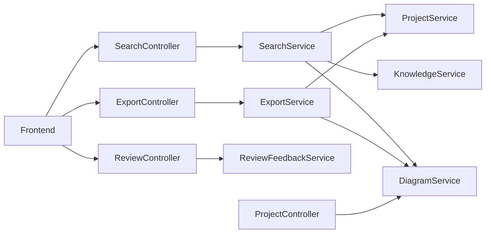

# Phase 6 — Search, Export, Review & Feedback

BlueprintAI Phase 6 adds the user productivity layer: unified search, professional exports, review/feedback collection, and project metadata — without collaboration or real-time editing (reserved for V2).

## Module Overview

| Module | Package | Responsibility |
|--------|---------|----------------|
| Search | `blueprintai-search` | Unified search across projects, components, knowledge, templates |
| Export | `blueprintai-export` | Server-side JSON, Markdown, SVG, PDF; export logging |
| Review | `blueprintai-review` | Ratings, helpful/not helpful, comments, AI quality metadata |
| Project (extended) | `blueprintai-project` | Pin, export count, AI metadata fields |
| Diagram (extended) | `blueprintai-diagram-engine` | Component search, diagram copy on duplicate |

Controllers live in `blueprintai-app` and compose modules via public interfaces only.

## Search Architecture

### API

- `GET /api/v1/search?q=&page=0&size=20` — unified search
- `GET /api/v1/search/history` — recent searches per user
- `DELETE /api/v1/search/history` — clear history

### Sources

1. **Projects** — via `ProjectService.listProjects` (name, description, system type, tags)
2. **Components** — via `DiagramService.searchComponents` (canvas node labels, categories, technologies)
3. **Knowledge** — via `KnowledgeService.searchConcepts`
4. **Templates** — static catalog (Netflix, Uber, WhatsApp, Instagram, Banking, E-commerce)
5. **Recent projects** — returned when query is empty

### Performance

- **Debounced** on the client (150–200ms)
- **Cached** on the server (`@Cacheable` cache `unifiedSearch`, 2-minute TTL via `CacheConfig`)
- Results scored and sorted by relevance; paginated server-side

### Frontend

- **⌘/Ctrl+K** command palette with live API results
- Dedicated **Search** page with tabs, highlights, and search history chips
- `features/search/` — API, hooks, highlight utilities

## Export Workflow

### API

- `GET /api/v1/projects/{projectId}/export?format=JSON|MARKDOWN|SVG|PDF|PNG`

### Server formats

| Format | Implementation |
|--------|----------------|
| JSON | Project + diagram canvas payload |
| Markdown | Architecture outline from nodes/edges |
| SVG | Vector rendering from node positions |
| PDF | OpenPDF document from Markdown content |
| PNG | Client-side rasterization (see below) |

### Client formats

- **PNG** — `features/export/utils/client-export.ts` rasterizes SVG from canvas snapshot for pixel-perfect output

### Logging

- Each export writes to `export_logs` and increments `projects.export_count`
- `ExportDialog` shows per-format progress with lazy client PNG path

## Review & Feedback Design

### API

- `POST /api/v1/feedback` — submit feedback
- `GET /api/v1/feedback/summary?projectId=` — aggregated ratings

### Target types

`ARCHITECTURE`, `COMPONENT`, `AI_EXPLANATION`, `LEARNING_CONTENT`, `DIAGRAM_QUALITY`, `EXPERIENCE`

### UI

- Lightweight `FeedbackWidget` popover (stars, thumbs, optional comment)
- Embedded in canvas toolbar — never blocks the main workflow

## AI Feedback Collection Strategy

Stored in `reviews` table (separate from user-visible diagram content):

| Field | Purpose |
|-------|---------|
| `ai_provider` | Provider used for generation |
| `ai_model` | Model identifier |
| `prompt_version` | Prompt template version |
| `generator_name` | Orchestrator generator |
| `generation_time_ms` | End-to-end generation time |
| `response_latency_ms` | Provider latency |
| `token_usage` | JSONB token breakdown |

Submit via `SubmitFeedbackRequest.aiMetadata` from the frontend when rating AI-generated content.

## Project Metadata Structure

`GET /api/v1/projects/{id}/metadata` returns:

- Created / updated / last opened
- Owner, version, theme
- Pin / favorite status
- Export count
- Last AI model, provider, prompt version
- Feedback summary (average rating, counts)

### Productivity APIs

- `PATCH /api/v1/projects/{id}/pin` — toggle pin
- `POST /api/v1/projects/{id}/duplicate` — copies project **and diagram**
- Existing: rename, favorite, archive, recent list

## Keyboard Shortcuts

| Shortcut | Action |
|----------|--------|
| ⌘/Ctrl+K | Open unified search / command palette |
| ⌘/Ctrl+S | Save diagram (workspace) |
| ⌘/Ctrl+Z | Undo |
| ⌘/Ctrl+Shift+Z | Redo |
| ⌘/Ctrl+0 | Fit view |

## Performance Optimizations

- Search result caching (server)
- Debounced search requests (client)
- Async export logging
- Paginated search results (max 50 per page)
- PNG export via client-side canvas (no blocking server render)
- TanStack Query stale times for search/history

## Future Extension Points

| Area | Extension |
|------|-----------|
| Export | DOCX, PPTX, Mermaid, PlantUML |
| Search | Full-text index on `canvas_data` JSONB, Redis cache |
| Review | Moderation queue, analytics dashboard |
| Metadata | Full version history table (structure prepared via `current_version`) |
| Collaboration | V2 — not in this phase |

## Database Migration

`V6__search_export_review.sql`:

- `projects`: `is_pinned`, `export_count`, AI metadata columns
- `search_history`, `export_logs` tables
- Extended `reviews` columns for feedback types and AI telemetry

## Health Check

`/api/v1/health` reports `search`, `export`, and `review-feedback` module readiness when dependencies are available.

## Integration Diagram

Each arrow crosses only **public API** interfaces — no internal package imports between feature modules.
